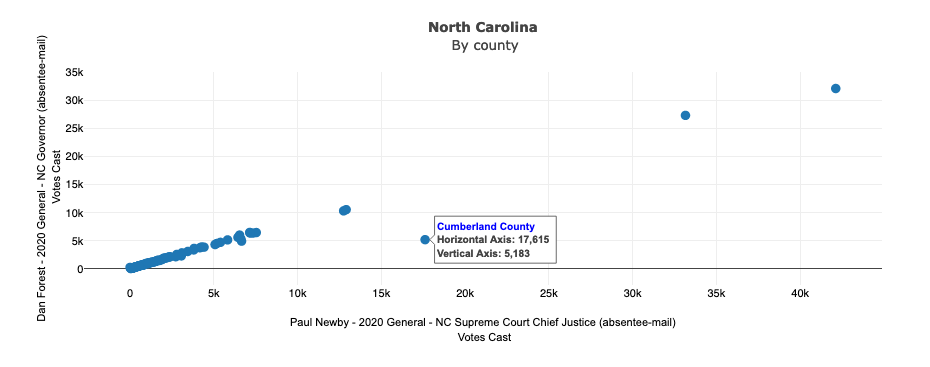
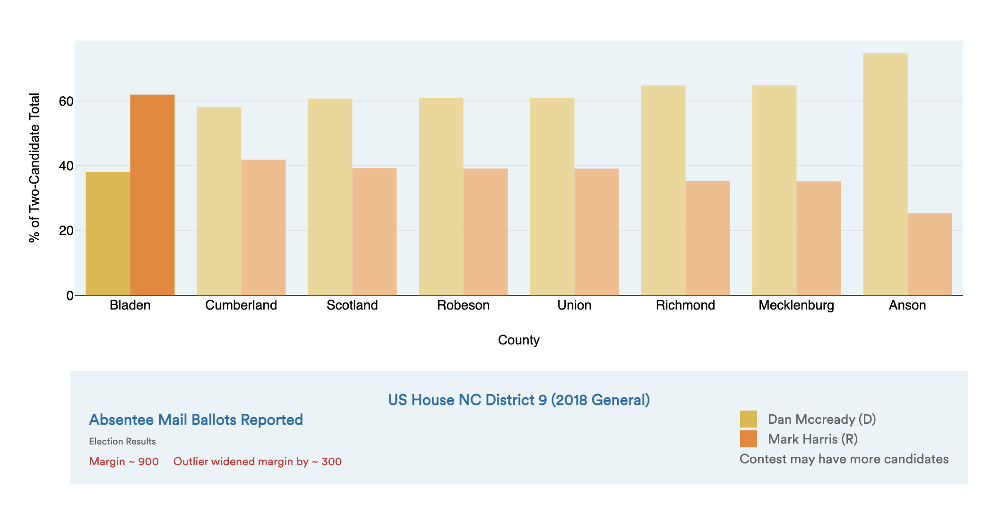

# Summary

The software package includes:

- Process for munging election results from a large variety of files into a single consolidated database. 
  - File types include csv, excel, json, xml (but not pdf), with arbitrary internal structure choices (e.g., xml tags, or column, row, blank line and header choices for flat files). Users do not need to know Python (other than the basics for installing and calling the package).
   - The system provides detailed messaging and error handling to support the user creating the parameters for a new file format or jurisdiction.
- Detailed jurisdiction-specific information for all 56 major United States jurisdictions and munging parameters sufficient to process county-level election results from the raw files published by the 56 Boards of Election. Except for the few jurisdictions where only pdf or html files are available, this processing is entirely automatic.
- Testing of election results in database against reference contest totals.
- Exports to json and xml NIST Common Data Formats V2 [@wack_election_2019], as well as exports to tab-separated flat text file.
- Scatter plot functionality by major subdivision (typically county) for comparing various vote counts and census or other external data. See for example \autoref{fig:NC_Cumberland_scatter}.

- Algorithmic curation of interesting one-county outliers within contest types (e.g., for all congressional contests in a particular jurisdiction). The algorithm takes into account the size of the outlier relative to the size of the contest margin. See for example \autoref{fig:Bladen_bar}. 

- Difference-in-difference analysis (following [@Herron:2019]) for contest types where vote counts by type (e.g., election-day, absentee, provisional) are available.

# Statement of need

In the United States, elections are designed and controlled by the individual states, districts and territories. In most of these jurisdictions, elections are implemented at the county level. This local control includes choices about when and how to publish election results. In countries with federal control of elections, such as Canada, consolidated nationwide election results are published by a government agency [@canada_elections:2021]. In the United States, consolidated election results are available only when a company or non-governmental agency chooses to make them available. There are some for-profit sources, such as the Associated Press, which devotes significant resources to consolidate results quickly for federal and gubernatorial elections. In addition to technical investments, the Associated Press deploys over 4,000 people on election day to collect and phone in results from county election boards [@associated_press_how:2021].  Academic sources [@medsl_mit_election_data__science_lab_mit_nodate, @mcdonald_united:2021] consolidate results for other contests as well, but on a slower timeline. To date, neither the private nor the academic sector has made tools for election consolidation available publicly. 

There is no comprehensive national archive of election results – not even federal election results, not to mention state and local contests.  Political scientists must find their own ad hoc, painstaking methods to assemble the data they need for their studies. Election agencies must find their own, ad hoc, painstaking methods for quality control. 

There are significant barriers to sharing analytical tools as well. Routine, robust analysis of election results could support verification of elections. Many of the pieces are in place – a growing literature of analyses, and a common data format developed by the National Institute of Standards and Technology [@wack_election_2019]. But without a good tool to take data in the format it arrives and transform it into analysis-ready format, much less analysis is done, and that analysis is less timely than it should be.

# Acknowledgements
This project was funded by the National Science Foundation (Awards #1936809, #2027089) and the Verified Voting Foundation. 

Thanks to all those who helped with the munging of the 2020 General Election, including Janaki Raghuram Srungavarapu, Brian Loy, Jon Wolgamott, Elliot Meyerson and Teresa Koberstein.

# References
